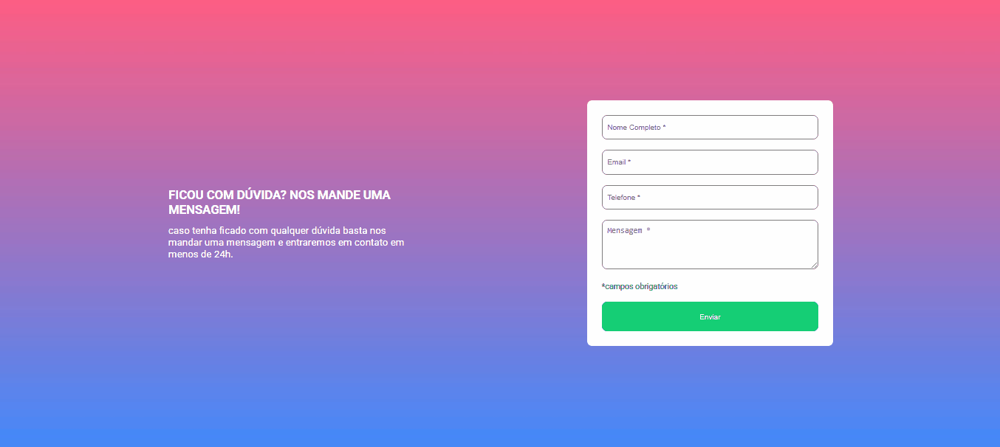

# Formulário com Validação

Projeto de um formulário que verifica se os campos estão preenchidos ou não.

## Tecnologias usadas 👨‍💻

- HTML 

- CSS 

- JavaScript 

- TypeScript 

## Prévia Desktop 💻



## Prévia Mobile 📱


## Propósito da aplicação 🤔

Demonstrar minhas habilidades na criação de uma página de cadastro.

## Funcionalidades da aplicação 💡

O projeto tem apenas uma função, exibir na tela se os campos estão preenchidos ou não, isso acontece quando selecionamos um deles e preenchemos ou não, e quando clicamos em enviar.

## Passo a passo para clonar o projeto 📝

Para clonar o projeto você pode usar o terminal de sua preferência, o passo a passo a seguir usa os comandos do gitbash como exemplo.

1 - Abra um terminal onde deseja colocar o projeto

2 - Clone o projeto
```
git clone "url do projeto"
```
3 - Acesse a pasta do projeto
```
cd projeto-formulario-com-validacao
```
4 - Instale as dependências do projeto
```
npm install
```
5 - Compile os arquivos TypeScript
```
npx tsc
``` 
ou
```
tsc
```
6 - Abra no vscode
```
code .
```
7 - Execute o projeto usando o Live server